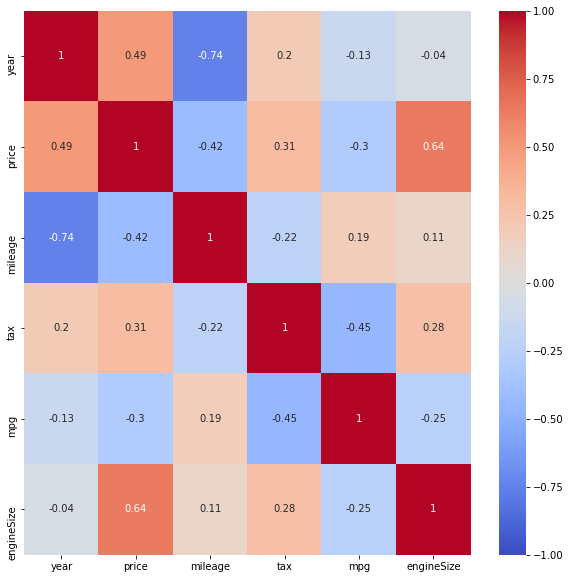
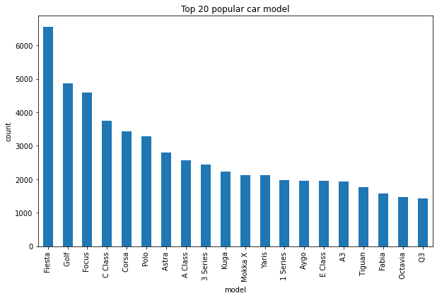
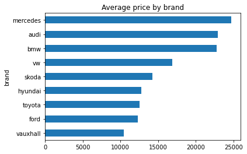
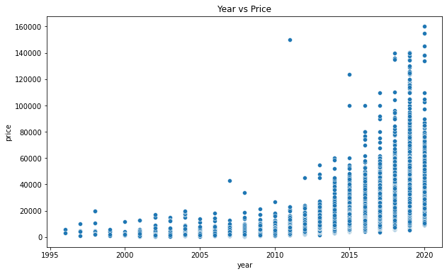
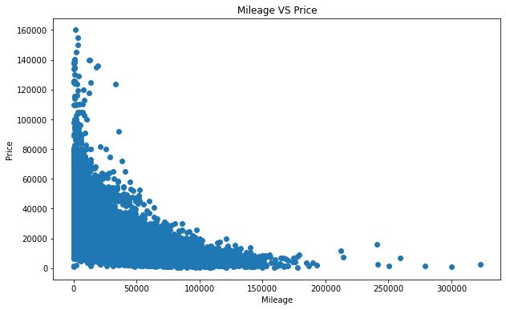
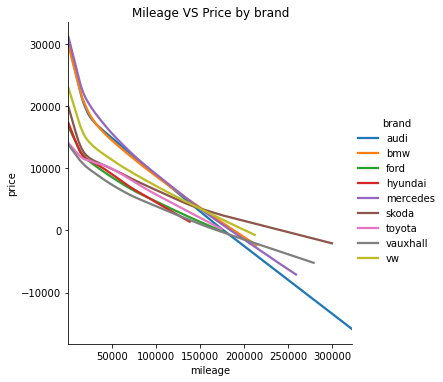
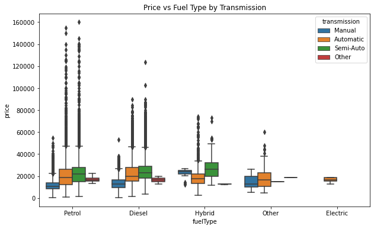
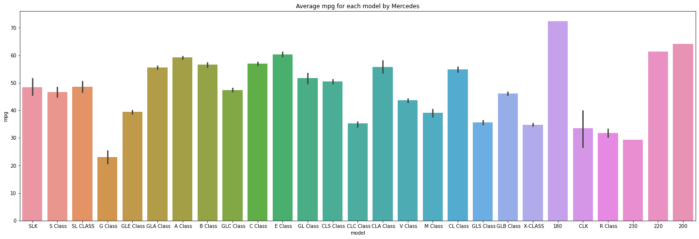
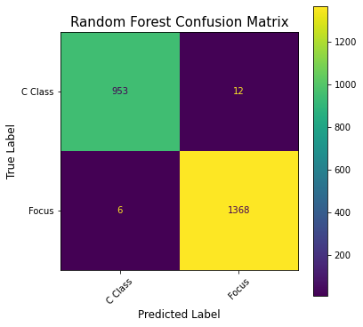

# Used Car Price Predication and Classification

## Problem Statement:

I have been hired by a used car selling company to build a model that can predict the price of used cars in British market based on 9 features provided. Secondly, for Mercedes C Class & Ford Focus cars which are two of the most popular cars our company sells, I also want to make a classifier what model of the used car is from.

## Data Gathering

Data was collected from the 100,000 UK Used Car Data set [Used Car Data set](https://www.kaggle.com/adityadesai13/used-car-dataset-ford-and-mercedes). There are 9 different data set corresponding to each car manufacturer.

## Data Dictionary

|Feature|Type|Description|
|---|---|---|
|**model**|*object*|Model of the car.|
|**year**|*int*|Registration year.|
|**price**|*int*|Price of the car.|
|**transmission**|*object*|Type of gearbox used.|
|**mileage**|*int*|Distance the car has travlled.|
|**fuelType**|*object*|Type of fuel used.|
|**tax**|*int*|Tax applied.|
|**mpg**|*int*|Miles per gallon.|
|**engineSize**|*int*|Size of the car engine.|

## Data Cleaning

- The 9 data sets are clean. They don't have duplicate or NaN values. I dropped the cars which have very old age and the wrong age.
- I combined the 9 data sets in one file and added a brand column to reflect the manufacturer information.

## EDA

The first thing that I created a heatmap that displays the correlation between car price and all other features.

Secondly, I checked the distribution of all the features. Then, I checked the top 20 popular car models.

I checked the average price by brand. Mercedes, Audi and BMW are the most expensive brand while Toyota, Ford and Vauxhall are cheapest.

I checked the relationship between year and price. The older the car, the lower the price.

Next, I wanted to look at the relationship between the mileage and price: 

I also then wanted to look at each brand. I created a line chart to show the relationship between mileage and price by brand. I can see that as the mileage increases, the price decreases. The Audi sharply decreases the price. At the same time, Skoda decreases the price slower compared to other brands.

Then, I created the box plot to see the relationship between price and fuel type by transmission.

I lastly wanted to check the specific brand - Mercedes. I checked the distribution counts of Mercedes models, the average price, the average engine size and average mpg by model. 

After completing the EDA, it was time to start building the models.

## Models

For this project, I chose to do two separate paths of model creation. The first path was to use different regressors in order to predict the price based on all of the features. The second path was to do classifier models to predict the Mercedes C Class & Ford Focus cars. 

### Regression

The first model that I explored was a Multiple Linear Regression Model. I used 5 features (year, mileage, tax, mpg, engineSize) to predict the price and got R2 score of 0.7036. Then, I created the dummy variables (brand, model, fuel type and transmission) and did Linear Regression. I got 0.8631 after having dummy features.

Then, I did Ridge and Lasso for the Linear Regression and got R2 score of 0.8628 and 0.8600 respectively.

Next, I tried Decision Tree Model (0.9410), Random Forest Model (0.9609) and Adaboost Model (0.2005).

### Classification

I did a few models to make the classifier for the car for two of our most popular models - Mercedes C Class and Ford Focus. I also did GridSearch for each model.

The Logistic Regression Model got 0.9137. The KNN Model achieved 0.9693. The Decision Tree Model had score of 0.9882. The Random Forest Model got the highest score 0.9906. The AdaBoost Model and Support Vector Model got 0.9843 and 0.9078.

## Conclusion

The Linear Regression Model got 86% accuracy. The Ridge and Lasso didn't help improve the Linear Regression Model. The Random Forest Model preformed best with accuracy of 96%. All the classification models performed well. The Random Forest Model worked best with the score of 0.9906.

If we want to expand the data set and perform the models better, the recommendation is to add more information, such as the damage information about the car, car service records, car add-ons and color of the car.
